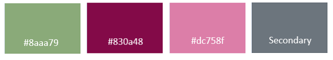

# My Garden
## About
My Garden is a blog portal where garden lovers can meet and share nice pictures and experiences with other garden lovers. Currently the site contains these categories dahlias, vegetables and fruits, geraniums and pelargoniums, fuchsias, roses and finally others. 
When you visit My Garden you will first see a page with all the latest posts and from there you are free to explore the different categories so that you can find posts that you like. When you are ready to create your own blog you can sign up and then you can access your own blog page. 

## Target Audience
This website is meant to attract people who all have a common interest, gardens. 
Visitors visit the site to read about topics that they find interesting, look at nice pictures, and maybe get some new ideas or tips to try in their own garden. 

Bloggers that use the site likes to share their interest with others. Like Visitors they want to take part of other people’s publications. But they also want to create own blog posts and communicate with other Bloggers/showing their appreciation for others blog posts. 

The main reason for Visitors/Bloggers to revisit the website is that it contains interesting content. But also, that the page is easy to use and navigate and has a design that makes their posts look nice. 

## Table of contents
- [UX](#design)
    - [User stories](#user-stories)
- [Technologies used](#technologies-used)
    - [Languages](#languages)
    - [Frameworks and libraries](#frameworks-and-libraries)
    - [Databases](#databases)
    - [Storage](#storage)
    - [Other tools](#other-tools)
- [Page Access Overview](#page-access-overview)
- [Features](#features)
    - [Navbar](#navbar)
    - [Footer](#footer)
    - [Blog post](#blog-post)
    - [Comment field](#comment-field)
    - [Home](#home)
    - [Blog post detail](#blog-post-detail)
    - [Posts by category](#posts-by-category)
    - [Create Post](#create-post)
    - [Update Post](#update-post)
    - [Delete Post](#delete-post)
    - [My blog](#my-blog)
    - [Settings](#settings)
    - [Search Results](#search-results)
- [Design](#design)
    - [Color-scheme](#color-scheme)
    - [Typography](#typography)
    - [Wireframes](#wireframes)
    - [Database Scheme](#database-scheme)
- [Testing](#testing)
- [Bugs corrections and improvements](#bugs-corrections-and-improvements)
    - [Solved bugs](#solved-bugs)
    - [Future improvements](#future-improvements)
- [Deployment](#deployment)
    - [Local deployment](#local-deployment)
    - [Heroku deployment](#heroku-deployment)
- [Credits](#credits)
    - [Code](#code)
    - [Content and media](#content-and-media)

## UX
### User stories
[#3](https://github.com/MartinaB91/project4-my-blog/issues/3) Epic: Sign in with username
-   [#19](https://github.com/MartinaB91/project4-my-blog/issues/19) As a **Admin** I want to **sign-in with my username** so that I can **manage the blog content**.
-   [#28](https://github.com/MartinaB91/project4-my-blog/issues/28) As a **Blogger** I want to **sign in with my username** so that I can **manage my blog content**.

[#37](https://github.com/MartinaB91/project4-my-blog/issues/37) Epic: Ability to CRUD blog posts as Blogger:
-   [#38](https://github.com/MartinaB91/project4-my-blog/issues?38) As a **Blogger** I want to **create posts** so that I can **fill my blog with content that I like**
-   [#25](https://github.com/MartinaB91/project4-my-blog/issues/25) As a **Admin/Blogger/Visitor** I want to **search for posts** so that I can **find the topics that I wan't to read about faster**.
-	[#39](https://github.com/MartinaB91/project4-my-blog/issues/39) As **Blogger** I want to **update my posts** so that I can **make corrections if needed**.
-	[#29](https://github.com/MartinaB91/project4-my-blog/issues/29) As a **Blogger** I want to **delete posts I have posted** so that **my blog only contains the content I selected**.

[#6](https://github.com/MartinaB91/project4-my-blog/issues/6) Epic: Ability to CRUD blog posts as Admin
-   [#23](https://github.com/MartinaB91/project4-my-blog/issues/23) As a **Admin** I want to **create posts** so that I can **give** the bloggers useful information.
-   [#25](https://github.com/MartinaB91/project4-my-blog/issues/25) As a **Admin/Blogger/Visitor** I want to **search for posts** so that I can **find the topics that I wan't to reed about faster**.
-   [#26](https://github.com/MartinaB91/project4-my-blog/issues/26) As **Admin** I want to **update posts** so that I can **change the content in bloggers posts when needed**.
-   [#27](https://github.com/MartinaB91/project4-my-blog/issues/27) As a **Admin** I want to **delete posts** so that **the blog only contains the content I selected**.
-   [#45](https://github.com/MartinaB91/project4-my-blog/issues/45) As a **Admin** I want to **review all posts before they are published** so that I can **verify that no inappropriate content is published**.

[#7](https://github.com/MartinaB91/project4-my-blog/issues/7) Epic: Display blog post properties timestamp & category
-   [#24](https://github.com/MartinaB91/project4-my-blog/issues/24) As a **Admin/Blogger/Visitor** I want to **see which time and date the post was posted** so that I can **follow the posts timeline**.
-   [#22](https://github.com/MartinaB91/project4-my-blog/issues/22) As a **Blogger/Admin/Visitor** I want to **to see which category the post is posted in** so that I can **publish/view other posts in the same category**.
-   [#36](https://github.com/MartinaB91/project4-my-blog/issues/36) As a **Admin** I want to **be able to create blog categories** so that **the users can better organize their posts and the visitors easier can find content of interest**.

[#5](https://github.com/MartinaB91/project4-my-blog/issues/5) Epic: Implement functionality for comment and like
-   [#21](https://github.com/MartinaB91/project4-my-blog/issues/21) As a **Blogger** I want to **comment on posts** so that I can **can interact with the publisher and other readers**.
-   [#20](https://github.com/MartinaB91/project4-my-blog/issues/20) As a **Blogger** I want to **like/unlike posts** so that I can **show my appreciation**.
-   [#12](https://github.com/MartinaB91/project4-my-blog/issues/12) As a **Admin** I want to **view all unhandled comments** so that I can **see which status a comment has**.
-   [#18](https://github.com/MartinaB91/project4-my-blog/issues/18) As a **Admin** I want to **approve or disapprove comments** so that I can **control the content of my blog**.
-   [#16](https://github.com/MartinaB91/project4-my-blog/issues/16) As a **Blogger/Visitor** I want to **view comments on each post** so that I can **follow other people’s opinions**.

[#46]() Epic: View Bloggers personal posts & post status
-   [#47](https://github.com/MartinaB91/project4-my-blog/issues/47) As a **Blogger** I want to **view all posts I have created** so that I can **quickly  find, update or follow user interaction on my posts**.
- [#48](https://github.com/MartinaB91/project4-my-blog/issues/48) As a **Blogger** I want to **see if my post is published or not** so that I can **know if the Admin has approved my post**

## Technologies used
### Languages
- [Python (3.8.11)](https://www.python.org/)
- [HTML5](https://developer.mozilla.org/en-US/docs/Glossary/HTML5)
- [JavaScript](https://www.javascript.com/)
- [CSS](https://developer.mozilla.org/en-US/docs/Web/css)

### Frameworks and libraries
- [Bootstrap (5.0)](https://getbootstrap.com/) - Used for styling and make site responsive
- [Django (4.0.4) ](https://www.djangoproject.com/) - Used for core functionality 
- [Django Allauth (0.50.0)](https://django-allauth.readthedocs.io/en/latest/installation.html) - Used for authentication and registration
- [Crispy Bootstrap5 (0.6)](https://pypi.org/project/crispy-bootstrap5/) - Used for make forms look nicer
- [JQuery](https://jquery.com/) - Used for making user interaction more lively 
- [Font Awesome](https://fontawesome.com/) - Used for adding icons to website
- [Google Fonts](https://fonts.google.com/) - Used for fonts

### Databases
- [SQLite](https://www.sqlite.org/index.html) - Used as development database 
- [PostgreSQL](https://www.postgresql.org/) - Used as production database

### Storage
- [Cloudinary](https://cloudinary.com/) - Used for storing pictures

### Other tools
- [Black (22.6.0)](https://pypi.org/project/black/) - Used for formatting python files
- [Diagrams.net](https://app.diagrams.net/) - Used for creating database scheme
- [Gunicorn (20.1.0)](https://gunicorn.org/)
- [Pyscopg2 (2.9.3)](https://pypi.org/project/psycopg2/) - Used for connect PostgreSQL to Python 
- [Heroku](https://id.heroku.com/login) - Used to deploy app
- [Invisionapp](https://www.invisionapp.com/home) - Used for wireframes
- [GitHub Issues](https://github.com/features/issues) - Used for project planning 
- [Chrome DevTools](https://developer.chrome.com/docs/devtools/) - Used for debugging
- [Coolors](https://coolors.co/) - Used for choosing colors

## Page Access Overview
- There are three different roles with different access, visitor, blogger and admin. The administrator has access to admin page but can also be a blogger and because of this access all sites and functions. 

|Page              | Visitor | Blogger| 
|------------------|---------|--------|
|Home              | Yes     | Yes    |
|Blog post detail  | Yes	 | Yes    |
|Posts by category | Yes     | Yes    |
|Create Post       | No      | Yes    |
|Update Post       | No      | Yes    |
|Delete Post       | No      | Yes    |
|My blog           | No      | Yes    |
|Settings          | No      | Yes    |
|Search Results    | Yes     | Yes    |

## Features

In this section you will find out more about the different features this site contains.

### Navbar
-	As a non-authenticated user, the navbar contains “My Garden” and “Home” which both links to home page, a search icon that when expand shown a search field and a “Sign Up” button leading to a sign in form. 
-	 As an authenticated user the navbar contains the same content as above but the “Sign Up” button will instead display “Sign Out”. The navbar will also contain a dropdown menu named “My Blog” holding links to pages “My Blog”, “Create Post” and “Settings”.

### Footer
-	As non-authenticated user, the footer contains links to “Home” page and “Admin” login. 
-	As an authenticated user the footer also contains a link to “My Blog” page. 

### Blog post
-	All blog posts are sorted on order of creation, the latest post is displayed first. 
-	Every blog post contains a title which on published posts is a link to blog post detail, the author, date of creation, category, picture, body, and number of comments and likes. 
-	When a user likes a post the heart icon will be solid pink. 

### Comment field 

-	The comment section contains all approved comments and a field for the user to leave a comment. To view this section the user needs to click the comment icon and the comment section will expand. 
-	Every comment contains an author, date of creation. Posts that don’t have any comments displays the text: “This post has no comments”
-	If the user is authenticated, they are free to leave a comment else the user will be told to sign in before leaving a comment. Before a new comment is displayed it must be approved by Admin. 
-	When a user has left a comment the text: “Thank you! Your comment will soon be reviewed” will be shown. 

### Home 
The Home page contains three sections and looks the same for both authenticated and non-authenticated users. 
-	The first section, the video section contains a video, header and a flower quote. This is the first thing you see when you enter the page and is intended to make the site more welcoming. 
-	The second section, the latest post section displays the four latest posts created, if the Visitor/Blogger want to view more posts they can do so by using the pagination. 
-	The third section, the category section contains all active categories the Visitor/Blogger can choose to visit/publish in. 

### Blog post detail 
-	When clicking the post title, the user will be redirect to the blog post detail page. This page contains a single blog post, here the picture is larger, and the post is more in focus. 

### Posts by category
-	When a user selects a category, they will be redirected to a page containing all published posts in that category. 

### Create Post
This page is only for authenticated users. This page contains a form for creating a post. 
-	The Blogger can add a title, category, some content, one picture, and a meta description to make it easier for a search engine to find it. 

### Update Post
This page is only for authenticated users.
-	At this page the Blogger can update all parts of their post. When a post is updated, the user will be redirected to home page. 

### Delete post
This page is only for authenticated users.
-	When a Blogger click delete on a post they will be redirected to the delete post page and asked to confirm deletion.  When the post is deleted the user will be redirected to home page. 

### My blog 
This page is only for authenticated users
-	All Bloggers have a page called “My page”. On this page the Blogger will find all posts they have written. Both published and unpublished. This makes it possible for the user to follow if the post has been published or if its waiting on approval. 

### Settings
This page is only for Authenticated users
-	On this page the user can choose to leave more information about themselves. Settings page contains fields for first name, last name, email, and profile image. 
In the future this information could be used to highlight the user on the home page so that other users can choose to view posts from a specific author. 
-	This page also contains a link to the page were the Bloggers can change password. 

### Search Results
-	To search the user needs to expand the search icon in the navbar and enter what they are searching for. They will then be redirected to the search result page and the result is displayed in two fields, one for posts and one for categories. If no result is found the following text is displayed: “No posts found... Please try again” and “No categories found... Please try again”.

## Design 
### Color-scheme
- The colors chosen for the site is soft green, dark red, soft pink and grey. 
- Edit buttons (#8aaa79), Delete buttons (#830a48), Text in quotes, author name in blog posts and for some links (#dc758f) and All other buttons (Bootstrap secondary)

### Typography

- The font used for H1 and H2 headers is Amatic SC with fallback cursive.

- The font used for all other text is Lato with fallback sans-serif. 

### Wireframes 
- [**Phone**](readme-images/wireframe_phone.PNG)
- [**Tablet**: Home and Posts by category page](readme-images/wireframe_tablet_1.PNG)
- [**Tablet**: My blog and Blog post detail page](readme-images/wireframe_tablet_2.PNG)
- [**Desktop**: Home page](readme-images/wireframe_desktop_1.PNG)
- [**Desktop**: Posts by category, My blog and blog post detail page](readme-images/wireframe_desktop_1.PNG)

### Database Scheme

## Testing
## Bugs corrections and improvements

### Solved bugs
- [#43](https://github.com/MartinaB91/project4-my-blog/issues/43) Like-btn don't "checked"
- [#44](https://github.com/MartinaB91/project4-my-blog/issues/44) Can't update img on post as Blogger
- [#50](https://github.com/MartinaB91/project4-my-blog/issues/50) Page not loading when user not signed 

### Future improvements
The following epics were planed but cut off due to the time frame. In the future this could be added:
- [#1](https://github.com/MartinaB91/project4-my-blog/issues/1) Epic: Advertise popular blog content
- [#2](https://github.com/MartinaB91/project4-my-blog/issues/2) Epic: Connecting users to the bloggers social medias

Other improvements: 
- Build automatic tests before building code to prevent finding bugs late in the development process (TDD).
- Add functionality for respond to a comment.
- Blog app could be named myblog for better overwiev. 

## Deployment
### Local deployment
### Heroku deployment

## Credits
### Code
- [api.jquery.com](https://api.jquery.com/) - Used when building  functions
- [Dev.to](https://dev.to/radualexandrub/how-to-add-like-unlike-button-to-your-django-blog-5gkg) - Used as inspiration when building like/unlike button.
- [Django documentation](https://docs.djangoproject.com/en/4.0/) - Used throughout the project.
- [geeksforgeeks](https://www.geeksforgeeks.org/class-based-generic-views-django-create-retrieve-update-delete/?ref=rp) - Used as inspiration when creating class based views.
- [geeksforgeeks](https://www.geeksforgeeks.org/how-to-create-and-use-signals-in-django/) - Used as inspiration when creating django signals.
- [Medium.com](https://medium.com/@nishalk25121999/how-to-make-a-like-button-using-django-ajax-d2db38e6d2f8) - Used as inspiration when building like button using AJAX.
- [Stackoverflow, context data in template](https://stackoverflow.com/questions/61022964/how-do-i-access-the-context-data-in-the-template) - Used as inspiration when buidling BlogPostList/MyBlogPostList view.
- [Stackoverflow, filter](https://stackoverflow.com/questions/739776/how-do-i-do-an-or-filter-in-a-django-query) - Used as inspiration when buidling search page.

### Content and media
- [Bloommaker](https://www.bloomaker.com/blog/55-inspirational-flower-quotes) - Used for flower quote in header
- [Pexels](https://www.pexels.com/sv-se/)

